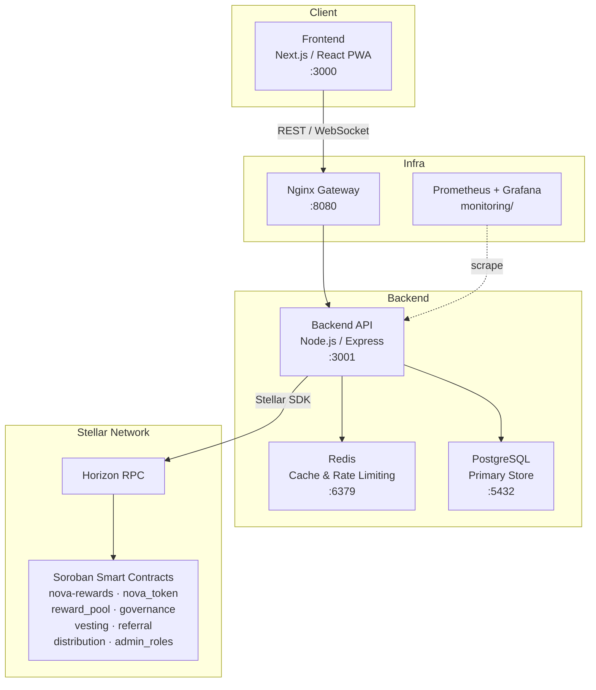

<p align="center">
  
</p>

<h1 align="center">Nova Rewards</h1>

<p align="center">
  A blockchain-powered loyalty platform that lets businesses issue tokenized rewards on the Stellar network.
</p>

<p align="center">
  <a href="https://github.com/barry01-hash/Nova-Rewards/actions/workflows/ci.yml"></a>
  <a href="docs/audits/wcag-accessibility-audit.md"></a>
  <a href="docs/security/README.md"></a>
</p>

---

## Overview

Nova Rewards replaces fragmented, opaque loyalty programs with on-chain token issuance. Merchants create reward campaigns; users earn, hold, and redeem NOVA tokens directly from a crypto wallet. Every transaction is verifiable on Stellar — no black-box points systems.

**Who this repo is for:**
- **Developers** building integrations or contributing features
- **Merchants** evaluating the platform or self-hosting
- **Contributors** looking for a starting point

---

## Architecture



**Key directories:**

| Path | What lives there |
|------|-----------------|
| `novaRewards/frontend/` | Next.js PWA — pages, components, stores |
| `novaRewards/backend/` | Express API — routes, services, DB repos |
| `contracts/` | Soroban smart contracts (Rust) |
| `novaRewards/database/` | SQL migrations (run in order) |
| `monitoring/` | Prometheus, Grafana, Alertmanager configs |
| `infra/` | Terraform modules (VPC, RDS, EC2, ElastiCache) |
| `k8s/` | Kubernetes manifests + Helm chart |
| `docs/` | All extended documentation |

---

## Tech Stack

| Layer | Technology |
|-------|-----------|
| Blockchain | Stellar |
| Smart Contracts | Soroban (Rust, `wasm32v1-none`) |
| Frontend | Next.js 14, React, Tailwind CSS, Zustand |
| Backend | Node.js 20, Express, PostgreSQL 16, Redis 7 |
| Auth | JWT (access + refresh tokens) |
| Wallet | Freighter browser extension |
| Infra | Docker Compose, Kubernetes, Helm, Terraform |
| Monitoring | Prometheus, Grafana, Alertmanager |
| CI/CD | GitHub Actions |

---

## Quick Start

> Gets you running locally in under 15 minutes.

### Prerequisites

Install these tools before cloning. The versions listed are the minimum tested; newer patch releases are generally safe.

| Tool | Minimum version | How to verify | Install |
|------|----------------|---------------|---------|
| Docker Desktop | 20.10 / Desktop 4.x | `docker --version` | [docker.com](https://www.docker.com/products/docker-desktop) |
| Node.js | 20.x LTS | `node --version` | [nodejs.org](https://nodejs.org) — use `nvm` to manage versions |
| npm | 10.x (bundled with Node 20) | `npm --version` | — |
| Rust (stable toolchain) | 1.75+ (`stable` channel) | `rustc --version` | `curl --proto '=https' --tlsv1.2 -sSf https://sh.rustup.rs \| sh` |
| Stellar CLI (`stellar`) | 21+ | `stellar --version` | installed by `setup-soroban-dev.sh` |
| Freighter browser extension | latest | visit the extension page | [freighter.app](https://www.freighter.app) |

> **Windows users:** use PowerShell 7+ and run the `.ps1` equivalents for shell scripts. WSL 2 also works.

---

### 1 — Clone

```bash
git clone https://github.com/barry01-hash/Nova-Rewards.git
cd Nova-Rewards
```

**Expected output:**
```
Cloning into 'Nova-Rewards'...
remote: Enumerating objects: …
```

---

### 2 — Configure environment

```bash
cp novaRewards/.env.example novaRewards/.env
```

Open `novaRewards/.env` and fill in the required values. For a local dev environment these are the only **strictly required** changes from the defaults:

| Variable | What to set |
|----------|-------------|
| `JWT_PRIVATE_KEY` / `JWT_PUBLIC_KEY` | Generate with `node novaRewards/backend/scripts/generate-jwt-keys.js` |
| `FIELD_ENCRYPTION_KEY` | Generate with `node -e "console.log(require('crypto').randomBytes(32).toString('hex'))"` |
| `ISSUER_PUBLIC` / `ISSUER_SECRET` | Generate a testnet keypair at [laboratory.stellar.org](https://laboratory.stellar.org/#account-creator?network=test) |
| `DISTRIBUTION_PUBLIC` / `DISTRIBUTION_SECRET` | Second keypair from the same tool |

Everything else (`DATABASE_URL`, `REDIS_URL`, `STELLAR_NETWORK`, etc.) defaults to the Docker Compose service addresses and can be left as-is for local development.

**Verify the file was created:**
```bash
ls -la novaRewards/.env   # should exist and not be empty
```

---

### 3 — Start the full stack

```bash
docker compose up --build
```

Docker pulls images on first run — this takes 2–5 minutes. Subsequent starts take under 30 seconds.

**Expected output (once healthy):**
```
nova-frontend-1  | ▲ Next.js 14.x
nova-frontend-1  | - Local: http://localhost:3000
nova-backend-1   | Server listening on port 3001
nova-postgres-1  | database system is ready to accept connections
nova-redis-1     | Ready to accept connections
```

Services and ports:

| Service | URL | Notes |
|---------|-----|-------|
| Frontend | http://localhost:3000 | Next.js — hot reload active |
| Backend API | http://localhost:3001 | Express — hot reload via nodemon |
| Health check | http://localhost:3001/health | Returns `{"status":"ok"}` when backend is up |
| Nginx gateway | http://localhost:8080 | Reverse proxy (optional) |
| PostgreSQL | localhost:5432 | Migrations run automatically on first start |
| Redis | localhost:6379 | — |
| Stellar standalone | http://localhost:8000 | Soroban RPC at `http://localhost:8000/rpc` |

**Verify the stack is healthy:**
```bash
curl http://localhost:3001/health   # {"status":"ok"}
curl http://localhost:3000          # returns HTML
```

To run only the infrastructure (no app containers):
```bash
docker compose up postgres redis stellar
```

To stop without deleting data:
```bash
docker compose down
```

To also wipe persisted volumes (full reset):
```bash
docker compose down -v
```

---

### 4 — Set up Soroban contracts

> Skip this step if you only need the frontend/backend — the app works without locally deployed contracts by pointing to testnet contract IDs.

```bash
./scripts/setup-soroban-dev.sh   # installs wasm32-unknown-unknown target, Stellar CLI, registers local network
./scripts/build-contracts.sh     # compiles all contracts → target/wasm32-unknown-unknown/release/*.wasm
./scripts/test-contracts.sh      # runs Rust unit tests for every contract
```

**PowerShell (Windows):**
```powershell
./scripts/setup-soroban-dev.ps1
./scripts/build-contracts.ps1
./scripts/test-contracts.ps1
```

**Expected output of `build-contracts.sh`:**
```
Compiling nova_token ...
Compiling nova_rewards ...
...
Finished release [optimized] target(s)
✓ All contracts compiled successfully
```

**Expected output of `test-contracts.sh`:**
```
running N tests
test test_xxx ... ok
...
test result: ok. N passed; 0 failed
```

---

### 5 — Run application tests

With Docker running (for the database), execute from the repo root:

```bash
cd novaRewards
npm run test:backend    # Jest — backend unit + integration tests
npm run test:frontend   # Jest — frontend component tests
```

**Expected output:**
```
Test Suites: N passed, N total
Tests:       N passed, N total
```

---

### Common setup failures

#### Port already in use

**Symptom:** `Error starting userland proxy: listen tcp4 0.0.0.0:5432: bind: address already in use`

**Fix:** Stop the conflicting service or change the host port in `docker-compose.yml`:
```bash
# Find what's using port 5432:
sudo lsof -i :5432
# Then stop it, or change the port mapping in docker-compose.yml:
#   "5433:5432"  # maps host 5433 → container 5432
```
Common conflicts: local PostgreSQL (`brew services stop postgresql`), local Redis (`brew services stop redis`).

---

#### Missing or invalid `.env` file

**Symptom:** Backend exits immediately with `Missing required env var: JWT_PRIVATE_KEY` (or similar).

**Fix:**
```bash
# Check the file exists:
ls -la novaRewards/.env

# Re-copy if missing:
cp novaRewards/.env.example novaRewards/.env

# Regenerate JWT keys:
node novaRewards/backend/scripts/generate-jwt-keys.js
# Then paste the output into .env for JWT_PRIVATE_KEY and JWT_PUBLIC_KEY
```

---

#### Docker not running

**Symptom:** `Cannot connect to the Docker daemon at unix:///var/run/docker.sock`

**Fix:** Start Docker Desktop (macOS/Windows) or the Docker daemon (Linux):
```bash
# Linux:
sudo systemctl start docker
# macOS/Windows: open Docker Desktop from the Applications menu
```

---

#### `docker compose up` hangs at database migrations

**Symptom:** Backend container is `healthy` but frontend shows a connection error.

**Fix:** The migration step can time out if PostgreSQL isn't ready. Restart just the backend:
```bash
docker compose restart backend
```

---

#### Rust build fails: `error[E0463]: can't find crate for ...`

**Symptom:** `./scripts/build-contracts.sh` exits with a linker or crate error.

**Fix:** Ensure the `wasm32v1-none` target is installed:
```bash
rustup target add wasm32v1-none
rustup update stable
```

---

For disclosure policy, scope, severity, and reward tiers, see [SECURITY.md](./SECURITY.md).

---

## Environment Setup

Copy `novaRewards/.env.example` to `novaRewards/.env` and fill in the required values:

```bash
cp novaRewards/.env.example novaRewards/.env
```

**Required variables:**

| Variable | Description |
|----------|-------------|
| `ISSUER_PUBLIC` / `ISSUER_SECRET` | Stellar issuer keypair (creates NOVA asset) |
| `DISTRIBUTION_PUBLIC` / `DISTRIBUTION_SECRET` | Stellar distribution keypair |
| `STELLAR_NETWORK` | `testnet` (dev) or `mainnet` (prod) |
| `DATABASE_URL` | PostgreSQL connection string |
| `REDIS_URL` | Redis connection string |
| `JWT_SECRET` | Long random string for signing JWTs |
| `NEXT_PUBLIC_API_URL` | Backend URL visible to the browser |

For Vercel deployments see `.env.vercel.example`. For production infrastructure see `infrastructure/.env.example`.

> Never commit `.env` files. They are in `.gitignore`.

---

## Contributing

1. **Find or create an issue** — all work is tracked in GitHub Issues.
2. **Branch** off `main`:
   ```
   feat/<short-description>
   fix/<short-description>
   docs/<short-description>
   ```
3. **Run checks** before pushing:
   ```bash
   npm run lint && npm run test
   # contracts:
   cargo fmt --all && cargo clippy -- -D warnings && cargo test
   ```
4. **Open a PR** against `main` — fill in the PR template and link the issue.
5. **Two approvals** required before merge. PRs are squash-merged.

Full details: [docs/pr-process.md](docs/pr-process.md) · [docs/code-style.md](docs/code-style.md)

---

## License

This project is proprietary. All rights reserved © Nova Rewards.  
See [LICENSE](LICENSE) for terms, or contact the maintainers for licensing inquiries.

---

## Documentation Index

| Document | Description |
|----------|-------------|
| [docs/PRD.md](docs/PRD.md) | Product requirements and roadmap |
| [docs/architecture.md](docs/architecture.md) | Detailed system architecture |
| [docs/system-design.md](docs/system-design.md) | Mermaid component, data-flow, contract interaction, and deployment topology diagrams |
| [docs/adr/README.md](docs/adr/README.md) | Architecture decision records for key system design choices |
| [docs/contracts.md](docs/contracts.md) | Contract addresses, deploy & upgrade instructions |
| [docs/abi-reference.md](docs/abi-reference.md) | Full ABI — function signatures, events, integration examples |
| [docs/error-codes.md](docs/error-codes.md) | Contract error codes and remediation |
| [docs/troubleshooting.md](docs/troubleshooting.md) | Troubleshooting guide — 15+ common errors with symptoms, causes, and fixes |
| [docs/api/README.md](docs/api/README.md) | REST API overview |
| [docs/api/openapi.json](docs/api/openapi.json) | OpenAPI 3.0 spec |
| [docs/deployment/guides.md](docs/deployment/guides.md) | Deployment guides (Docker, K8s, Vercel) |
| [docs/security/README.md](docs/security/README.md) | Security overview |
| [docs/security/threat-model.md](docs/security/threat-model.md) | Threat model |
| [docs/security/security-best-practices.md](docs/security/security-best-practices.md) | Security best practices |
| [docs/stellar/integration.md](docs/stellar/integration.md) | Stellar / Horizon integration guide |
| [docs/stellar/freighter-guide.md](docs/stellar/freighter-guide.md) | Freighter wallet integration — API, testing, error reference |
| [docs/tokenomics.md](docs/tokenomics.md) | Token economics |
| [docs/ops/runbook.md](docs/ops/runbook.md) | Operations runbook |
| [monitoring/README.md](monitoring/README.md) | Monitoring stack setup |
| [contracts/README.md](contracts/README.md) | Smart contracts overview |
| [novaRewards/README.md](novaRewards/README.md) | App-level setup (frontend + backend) |
| [infrastructure/README_DEVOPS_SETUP.md](infrastructure/README_DEVOPS_SETUP.md) | DevOps / infra setup |
| [ROADMAP.md](ROADMAP.md) | Issue tracker and priorities |

## API Documentation

Full API reference: https://udeibom.github.io/Nova-Rewards/